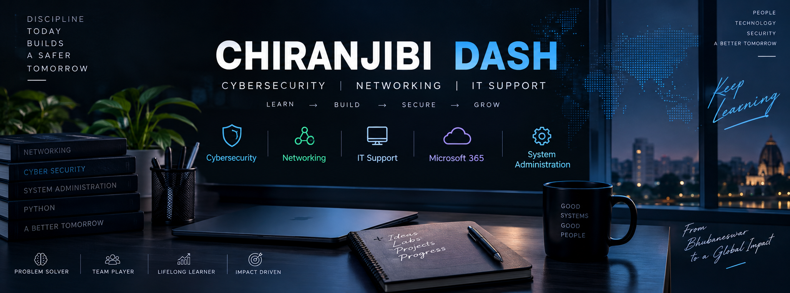

<h1>👋 Hi, I'm Chiranjibi Dash</h1>

<h3>Cybersecurity & Networking Enthusiast | IT Support | Security Operations</h3>

  
  

<b>LEARN</b> &nbsp;→&nbsp; <b>BUILD</b> &nbsp;→&nbsp; <b>SECURE</b> &nbsp;→&nbsp; <b>GROW</b>

---

## 🧑‍💻 About Me

I’m a **B.Tech Computer Science & Engineering student specializing in Cyber Security & Cyber Defense** at **Sri Sri University**, currently building practical experience across cybersecurity operations, networking, IT support, system administration, and security-focused projects.

My engineering journey includes cybersecurity internships at the **Cyber Security Operation Centre (CSOC), Odisha Computer Application Centre (OCAC)**, **Hindustan Aeronautics Limited (HAL)**, and **Infotact Solutions**.

I enjoy learning by **building practical systems, analysing security events, designing networks, troubleshooting technical problems, and applying security concepts to real-world use cases**.

---

<table>
<tr>
<td width="50%" valign="top">

## 🎯 Current Focus

🔭 **Building**  
AI-Based IoT Honeypot Deception System

🛡️ **Strengthening**  
Cybersecurity & Security Operations

🌐 **Practicing**  
Networking & Network Troubleshooting

💻 **Developing**  
IT Support & Systems Administration

🧪 **Labs**  
TryHackMe & Hack The Box

📚 **Certifications in Progress**  
CCNA 200-301 • MS-102 • CompTIA A+

</td>

<td width="50%" valign="top">

## 💼 Experience

### 🛡️ OCAC — CSOC Intern
**Feb 2026 – Mar 2026**  
SIEM • SOAR • Threat Intelligence • Blue Teaming • Threat Hunting • Incident Ticketing • SOC Operations

### 🛡️ HAL — Cybersecurity Intern
**Jun 2025 – Jul 2025**  
Python • Isolation Forest • Streamlit • GeoIP • Log Analysis

### 🛡️ Infotact Solutions — Cybersecurity Intern
**Dec 2024 – Feb 2025**  
SIEM • Apache2 • Log Monitoring • Network/SSL Troubleshooting

</td>
</tr>
</table>

---

# 🚀 Featured Projects

<table>
<tr>
<td width="50%" valign="top">

## 👁️ Netra — The Eye of Awareness

**SOC / Cybersecurity Project**

SOC-oriented project focused on **security monitoring and threat detection**.

🏆 Showcased at a **CyberDojo exhibition**.

</td>

<td width="50%" valign="top">

## 🔐 CrackNet

**AI-Based Password Cracking & Security Analyzer**

- Python + Flask
- Random Forest
- Password-strength assessment
- Crack-time prediction
- HIBP breach-data checks
- Weak-pattern detection

🔗 [Repository](https://github.com/Chiranjibidashworkshop/CRACKNET-AI-PASSWORD-CRACKING)

</td>
</tr>

<tr>
<td width="50%" valign="top">

## 🌐 Manufacturing Plant Network Design

**Cisco Packet Tracer**

- VLAN segmentation
- OSPF routing
- ACLs
- Port security
- SSH
- Logical segmentation
- Controlled traffic flow

🔗 [Repository](https://github.com/Chiranjibidashworkshop/Manufacturing-Plant-Network)

</td>

<td width="50%" valign="top">

## 🪤 AI-Based IoT Honeypot Deception System

### 🚧 Ongoing

Developing an AI-driven IoT security project focused on:

- IoT threat detection
- Honeypot / deception techniques
- Anomaly analysis
- Security monitoring
- Intelligent cybersecurity workflows

</td>
</tr>
</table>

---

# 🛠️ Tech Stack

### 🔐 Cybersecurity

### 🌐 Networking

### 💻 IT & Systems

### 🐍 Programming & Development

### 🧰 Security Labs

---

<table>
<tr>
<td width="50%" valign="top">

# 📜 Certifications

🟡 **Cisco CCNA 200-301** — In Progress  
🟡 **Microsoft MS-102** — In Progress  
🟡 **CompTIA A+** — In Progress

</td>

<td width="50%" valign="top">

# 🎓 Education

<table>
<tr>
<td width="120" valign="middle">

</td>

<td valign="middle">

### Sri Sri University
**B.Tech — Computer Science & Engineering**  
**Specialization:** Cyber Security & Cyber Defense  

📅 **2023 – 2027 (Expected)**  
📊 **CGPA: 8.3**  
📍 Cuttack, Odisha

**Relevant Coursework:**  
Operating Systems • DBMS • Algorithms • Computer Networks • Machine Learning • Cryptography

</td>
</tr>
</table>
---

# 🏆 Highlights

✅ Completed **Cyber Security Internship Training at OCAC CSOC**  
👁️ Showcased **Netra – The Eye of Awareness** at a CyberDojo exhibition  
🌐 Designed a secure **Manufacturing Plant Network** using Cisco Packet Tracer  
🤖 Currently developing an **AI-Based IoT Honeypot Deception System**  
🧪 Practiced offensive and defensive security through **TryHackMe & Hack The Box**

---

# 📊 GitHub Stats

 

---

# 📈 Contribution Activity

---

# 📫 Let's Connect

 

### 🔐 Learn → Build → Secure → Grow

